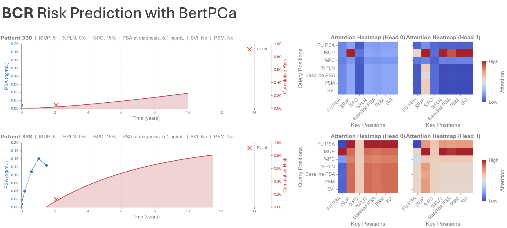
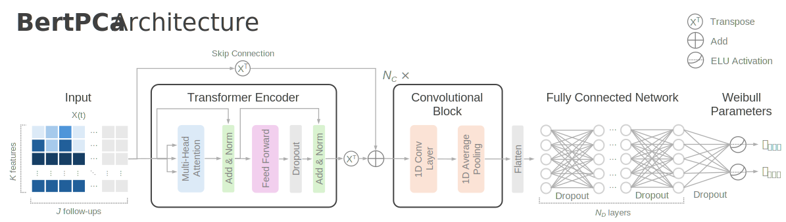

# BertPCa: Transformer-based Dynamic Survival Analysis for Prostate Cancer Post-Surgical Outcomes

🤖 BertPCa is a dynamic survival analysis model built on transformer architectures and Weibull distributions. It was originally developed to predict post-surgical biochemical recurrence and cancer-specific mortality in prostate cancer patients.

💡 Want to use BertPCa outside prostate cancer? No problem! BertPCa is highly flexible and can be applied to any longitudinal time-to-event dataset. To demonstrate this, we include the [PBC2 dataset](https://search.r-project.org/CRAN/refmans/DynForest/html/pbc2.html) in this repository, allowing you to train and evaluate the model on a non-oncological use case.

🚀 BertPCa leverages all available patient data up to the time of prediction, continuously updating risk estimates as new information becomes available.

🔎 Let's take a closer look: right after surgery, BertPCa predicted a relatively low 10-year cumulative risk of biochemical recurrence for a patient with ISUP grade group 5, but no positive lymph nodes or seminal vesicle invasion. As follow-up PSA measurements were incorporated over the next 18 months, the model progressively revised and increased its risk estimate.




## Installation

1. Clone the repository:
   ```bash
   git clone https://github.com/alterreal/bertpca
   cd bertpca
   ```

2. Install dependencies:

   ```bash
   pip install uv
   uv lock            
   uv sync         
   ```

## Quick Start


### Training

Train with the default configuration (paths and options in `config/config.yaml`):

```bash
uv run python scripts/train_bertpca.py
```

Save the best model to a specific path:

```bash
uv run python scripts/train_bertpca.py --output outputs/models/my_model.keras
```

### Hyperparameter tuning

Run Optuna optimization (default number of trials from config):

```bash
uv run python scripts/tune_bertpca.py
```

Customize trials and study name:

```bash
uv run python scripts/tune_bertpca.py --n-trials 100 --study-name my_study
```

Results and optimization log are written to `outputs/results/`.


## Model Architecture



1. **Input**: Static features (repeated across time) and dynamic features arranged in padded sequences of length `seq_length`.
2. **Transformer encoder**: Multi-head self-attention layers for sequence modeling.
3. **Convolutional blocks**: 1D convolutions with pooling for local feature extraction.
4. **Dense stack**: Fully connected layers.
5. **Weibull head**: Two outputs (alpha, beta) parameterizing the Weibull survival distribution.

## Evaluation Metrics

- **Time-dependent C-index**: Discrimination at prediction times `p_times` and evaluation times `e_times`.
- **Weighted C-index**: `weighted_c_index` in `bertpca.metrics` (inverse probability of censoring weighting).


## License

This project is licensed under the **MIT License**

## Contributing

Contributions are welcome. Please open an issue or submit a pull request.

## Acknowledgments

- Contents of `metrics.py` are credited to Changee Lee
